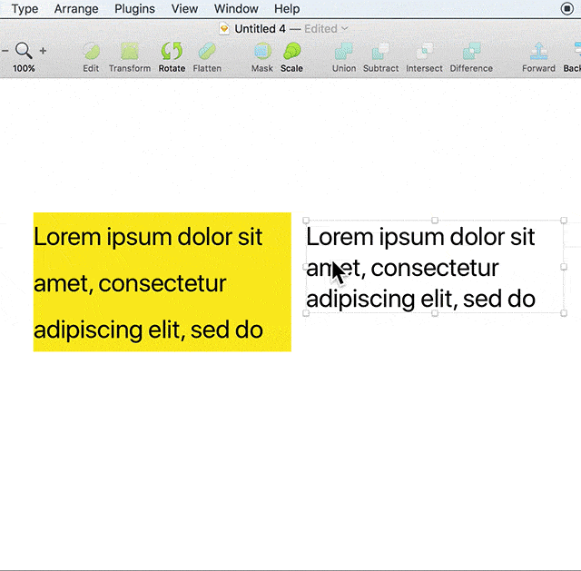

# Engineer Friendly Text

Engineer-Friendly-Text is a sketch plugin make text layer's metric friendly to iOS engineer.

## Why

Sketch's text layer have extra margin on the outer side when set lineHeight greater than default one. This is different with text views on iOS, which make engineer hard to implement the design precisely.

中文详细介绍[文章](https://zhuanlan.zhihu.com/p/27572662)

## What

This plugin automatically add a mask on text layer and crop it to the same height to text view on iOS. Extra margin before first line and below last line will be crop out. So iOS engineer can just layout views according to the frame in sketch file and adjust margin by hand no more.

This plug in also provide a convenient method to set line height multiple.

## Install

or donwload [here](https://github.com/leavez/sketch-engineer-friendly-text/releases/latest). You may give me a star 🌟 if you like it. 

## Changelog

- 1.1: add support for Chinese font
- 1.0: initial release
